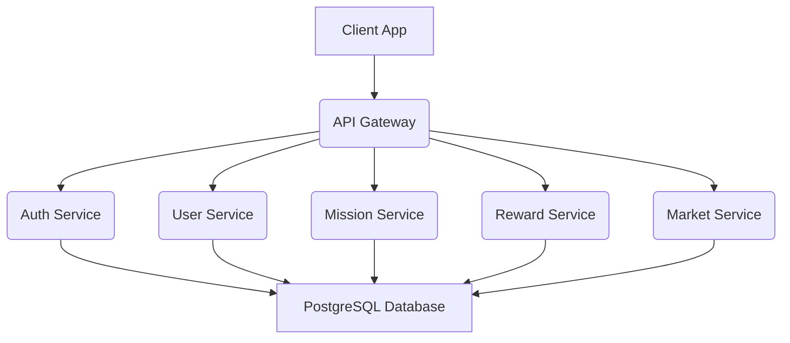

# 기술 요구사항 정의서 - COO-ANC (쿠앵크)

## 1. 개요

본 문서는 COO-ANC(쿠앵크) 프로젝트의 기술 요구사항을 정의하며, 특히 **아동의 실생활 행동을 기반으로 미션을 생성하고, 그 수행 결과를 가상 보상으로 전환하며, 보호자의 승인 절차를 통해 실제 소비 활동으로 연결하는 통합형 행동-보상-소비 연계 시스템**의 특허 가능한 구조와 **LangGraph 기반의 3대 AI 에이전트** 구현에 필요한 기술적 명세를 상세히 기술합니다. 이 문서는 개발팀이 프로젝트를 성공적으로 구현하기 위한 핵심 가이드라인으로 활용됩니다.

## 2. 시스템 아키텍처

COO-ANC는 클라이언트-서버 아키텍처를 기반으로 하며, AI 에이전트와 연동되는 마이크로서비스 아키텍처를 지향합니다. 주요 구성 요소는 다음과 같습니다.

*   **클라이언트**: React Native (모바일 앱), React (웹 앱)
*   **백엔드**: Node.js (Express.js 또는 NestJS), Python (AI/ML 서비스)
*   **데이터베이스**: PostgreSQL (Supabase)
*   **AI/ML**: LangChain, LangGraph, OpenAI/Gemini API (LLM), Vector DB (Pinecone, ChromaDB 등)
*   **클라우드 인프라**: AWS, Google Cloud Platform (GCP) 또는 Azure
*   **배포**: Docker, Kubernetes

### 2.1. 현재 시스템 아키텍처

### 2.2. 미래 시스템 아키텍처 (AI 에이전트 통합)

LangGraph 오케스트레이션 레이어를 통해 3대 AI 에이전트(온보딩, 스케줄, 분석/코칭)가 유기적으로 통합된 미래 시스템 아키텍처는 다음과 같습니다. 각 에이전트는 클라이언트 앱, 코어 서비스, 외부 API 및 LLM, 그리고 데이터베이스 레이어와 상호작용하며 COO-ANC의 핵심 기능을 수행합니다.

**[그림 1] COO-ANC 미래 시스템 아키텍처 (AI 에이전트 통합)**

**주요 특징:**
*   **클라이언트 레이어**: 부모 및 자녀 앱은 API Gateway를 통해 백엔드 서비스와 통신합니다.
*   **코어 서비스 레이어**: 인증, 사용자 프로필, 미션/루틴, 보상/마켓, 승인/배송 등 핵심 비즈니스 로직을 처리합니다.
*   **AI 에이전트 레이어 (LangGraph Orchestration)**: LangGraph Router를 중심으로 온보딩, 스케줄, 분석/코칭 에이전트가 유기적으로 연동됩니다. 각 에이전트는 LLM Provider, 외부 API (OCR/STT, Calendar), Vector DB (커리큘럼 지식)와 상호작용하며 지능적인 기능을 제공합니다.
*   **데이터베이스 레이어**: PostgreSQL 기반의 관계형 데이터베이스와 Vector DB를 활용하여 사용자 데이터, 미션/루틴 데이터, 보상/마켓 데이터, 그리고 RAG 기반의 커리큘럼 지식을 관리합니다.

## 3. LangGraph 기반 AI 에이전트 구현 명세

COO-ANC는 LangGraph 오케스트레이션 프레임워크를 활용하여 3가지 핵심 AI 에이전트를 구축합니다. 각 에이전트는 특정 사용자 경험을 개선하고 자동화하는 역할을 수행합니다.

### 3.1. 온보딩 에이전트 (Onboarding Agent)

*   **목표**: 신규 사용자(부모)의 초기 설정 부담을 줄이고, 자녀의 특성에 맞는 맞춤형 초기 루틴 및 보상 체계를 자동 설정.
*   **기능**:
    *   **대화형 설문**: 자연어 처리(NLP)를 통해 부모와의 대화에서 자녀의 연령, 성향, 현재 습관, 부모의 교육 목표 등을 파악.
    *   **초기 설정 추천**: 수집된 정보를 바탕으로 자녀의 레벨을 추정하고, 적합한 초기 미션 세트, 보상 비율(EXP/Credit), 마켓 상품 추천.
    *   **데이터 구조화**: 대화 내용을 파싱하여 `User` 및 `Child` 프로필, `Mission` 테이블에 초기 데이터를 자동 입력.
*   **기술 스택**: LangGraph (오케스트레이션), LLM (OpenAI/Gemini), NLP 라이브러리.

### 3.2. 스케줄 에이전트 (Schedule Agent)

*   **목표**: 부모의 루틴 및 일정 관리 부담을 경감하고, 자녀의 일정을 자동으로 반영하여 유연한 미션 스케줄링 지원.
*   **기능**: 
    *   **멀티모달 입력 처리**: 
        *   **사진**: 가정통신문, 식단표, 학원 시간표 등 이미지 파일 업로드 시 OCR(광학 문자 인식) 기술을 활용하여 텍스트 정보 추출.
        *   **음성**: 부모의 음성 명령(예: "다음 주 화요일은 소풍이라 미션 쉬게 해줘")을 Speech-to-Text(STT)로 변환하여 텍스트 정보 추출.
        *   **텍스트**: 직접 입력된 텍스트 정보(예: "이번 주말은 할머니 댁에 가서 미션 없음") 처리.
    *   **일정 분석 및 등록**: 추출된 텍스트 정보를 LLM이 분석하여 주요 일정(휴무일, 기념일, 특이사항)을 파악하고, `Calendar API`를 통해 부모 및 자녀의 캘린더에 자동 등록.
    *   **루틴 자동 최적화**: 휴무일/기념일 감지 시 해당 날짜의 미션 알람을 자동으로 Off하거나, 특별 미션으로 대체하는 등 루틴을 유연하게 조정.
    *   **다중 일정 등록**: 여러 개의 일정을 한 번에 입력받아 처리할 수 있도록 지원.
*   **기술 스택**: LangGraph, LLM, OCR API (Google Cloud Vision, AWS Textract 등), Speech-to-Text API (Google Cloud Speech-to-Text, OpenAI Whisper 등), Calendar API (Google Calendar API 등).

### 3.3. 분석 및 코칭 에이전트 (Analysis & Coaching Agent)

*   **목표**: 자녀의 행동 패턴을 분석하여 부모에게 맞춤형 교육 가이드를 제공하고, 대외비 경제 교육 커리큘럼을 기반으로 자녀의 성장을 촉진.
*   **기능**: 
    *   **행동 패턴 분석**: 자녀의 미션 완수율, 미션 실패 패턴, 보상 사용 내역, 마켓 구매 성향(소비 vs 저축) 등 시계열 데이터를 분석.
    *   **RAG 기반 코칭**: 사용자님이 제공한 **대외비 경제 교육 커리큘럼**을 Vector Database에 저장하고, 이를 RAG(Retrieval Augmented Generation) 방식으로 LLM에 연동하여 자녀의 행동 분석 결과에 대한 맞춤형 교육 가이드 및 미션 추천.
        *   **예시**: "아이가 오후 4시에 미션을 자주 놓치네요. 이는 집중력 저하 시간일 수 있으니, 이 시간대 미션 난이도를 조절하거나, 짧은 휴식 시간을 제안해 보는 것은 어떨까요? 커리큘럼 2단계의 '시간 관리' 역량 강화에 도움이 됩니다."
    *   **FQ (경제 지능) 리포트**: 자녀의 경제 개념 숙달도와 성장 과정을 시각화된 FQ 리포트 형태로 부모에게 제공.
*   **기술 스택**: LangGraph, LLM, Vector Database (Pinecone, ChromaDB 등), RAG 프레임워크, 시계열 데이터 분석 라이브러리 (Pandas 등).

## 4. 특허 핵심 기술 구현 명세

COO-ANC의 핵심 경쟁력이자 특허 출원 대상인 **"아동의 실생활 행동-가상 보상-보호자 승인-실제 소비 연계 시스템"**은 다음 기술 요소들의 유기적인 결합으로 구현됩니다.

### 4.1. 멀티모달 기반 미션 자동 생성 시스템

*   **기술**: 스케줄 에이전트의 멀티모달 입력 처리(OCR, STT) 및 LLM 기반의 의미론적 분석을 통해 비정형 데이터를 정형화된 미션 데이터로 변환.
*   **구현**: `Schedule Agent`가 `External APIs` (OCR, STT)를 통해 데이터를 수집하고, `LLM Provider`를 통해 미션의 종류, 난이도, 반복 주기, 보상 크레딧 등을 자동으로 제안.
*   **데이터 스키마**: `missions` 테이블에 `source_type` (e.g., 'OCR', 'Voice', 'Manual'), `source_data` (원본 데이터 저장) 필드 추가.

### 4.2. 동적 보상 가치 산정 및 전환 알고리즘

*   **기술**: 아동의 연령, 레벨, 미션 난이도, 완수율, 성취율 등 복합적인 요소를 기반으로 EXP와 Credit의 가치를 동적으로 산정하고, 가상 Credit을 실제 화폐 가치로 전환하는 알고리즘.
*   **구현**: `Reward Service` 내에 `DynamicRewardCalculator` 모듈 구현. `Child` 프로필의 `age`, `level`, `mission_logs`의 `completion_rate`, `difficulty` 등을 입력으로 받아 `EXP` 및 `Credit` 지급량을 결정.
*   **데이터 스키마**: `mission_templates` 테이블에 `base_exp`, `base_credit`, `difficulty` 필드 추가. `child_profiles` 테이블에 `current_level`, `total_exp`, `total_credit` 필드 관리.

### 4.3. 보호자 개입형 폐쇄 루프(Closed-loop) 결제 시스템

*   **기술**: 자녀의 가상 재화(Credit)를 통한 구매 요청이 보호자의 명시적인 승인 절차를 거쳐 실제 상점(Market Service)의 물류/배송 시스템과 연동되는 안전하고 통제된 결제 흐름.
*   **구현**: `Market Service`에서 자녀의 구매 요청 발생 시 `Approval Service`로 요청 전송. `Parent App`에서 승인/반려 처리. 승인 시 `External API` (커머스 API, 배송 API)를 통해 실제 상품 주문 및 배송 상태 업데이트.
*   **데이터 스키마**: `purchase_requests` 테이블에 `child_id`, `parent_id`, `item_id`, `credit_amount`, `status` (e.g., 'pending', 'approved', 'rejected'), `rejection_reason` 필드 추가. `delivery_status` 테이블에 `request_id`, `status` (e.g., 'ordered', 'shipping', 'delivered'), `tracking_info` 필드 추가.

### 4.4. 성취도 기반 적응형 인터페이스(Adaptive UI) 제어 기술

*   **기술**: 아동의 학습 및 행동 데이터를 실시간으로 분석하여 앱의 UI/UX(예: 독바 탭 구성, 기능 노출, 콘텐츠 난이도)를 동적으로 조절하는 기술.
*   **구현**: `Analysis & Coaching Agent`가 `child_profiles` 및 `mission_logs` 데이터를 분석하여 `current_level`을 업데이트. `Client App`은 `current_level`에 따라 `UI Renderer` 모듈을 통해 적합한 UI 컴포넌트(예: Level 1은 저금통만, Level 4+는 소셜 탭 추가)를 동적으로 로드.
*   **데이터 스키마**: `child_profiles` 테이블에 `current_level`, `ui_config_version` 필드 추가. `level_configs` 테이블에 `level_id`, `dockbar_tabs`, `enabled_features` 등 UI 관련 설정 정보 저장.

## 5. 경제 교육 커리큘럼 엔진 (RAG 기반)

*   **목표**: 사용자님이 제공한 대외비 경제 교육 커리큘럼을 시스템의 핵심 지식 베이스로 활용하여 AI 에이전트의 코칭 및 미션 추천의 정확성과 전문성을 극대화.
*   **구현**: 
    *   **데이터 전처리**: 커리큘럼 문서를 청크(Chunk) 단위로 분할하고 임베딩(Embedding) 벡터로 변환.
    *   **Vector Database 저장**: 변환된 임베딩 벡터를 Pinecone, ChromaDB와 같은 Vector Database에 저장.
    *   **RAG 연동**: `Analysis & Coaching Agent`가 사용자 질의(부모의 코칭 요청) 또는 자녀의 행동 분석 결과에 따라 관련성 높은 커리큘럼 청크를 Vector Database에서 검색(Retrieval)하고, 이를 LLM의 컨텍스트에 추가하여 답변(Generation)을 생성.
*   **기술 스택**: Python, LangChain, Vector Database (Pinecone, ChromaDB), Embedding Model (OpenAI Embeddings, Google Universal Sentence Encoder 등).

## 6. 기술 스택 및 개발 환경

*   **프론트엔드**: React Native (Expo), React, TypeScript, Tailwind CSS
*   **백엔드**: Node.js (NestJS), Python (FastAPI for AI services)
*   **데이터베이스**: PostgreSQL (Supabase)
*   **인프라**: Docker, Kubernetes, AWS/GCP (EC2, S3, RDS, EKS/GKE)
*   **CI/CD**: GitHub Actions, Vercel (프론트엔드 배포)
*   **버전 관리**: Git, GitHub
*   **테스트**: Jest, React Testing Library

## 7. API 명세 (주요 엔드포인트 예시)

### 7.1. 미션 관리 API

*   `POST /api/missions/create`: AI 에이전트 또는 부모가 미션 생성
*   `GET /api/missions/child/{childId}`: 자녀의 현재 미션 목록 조회
*   `POST /api/missions/{missionId}/complete`: 자녀의 미션 완료 처리
*   `POST /api/missions/{missionId}/rollback`: 부모의 미션 롤백 처리

### 7.2. 보상 관리 API

*   `POST /api/rewards/grant`: 미션 완료 시 EXP 및 Credit 지급
*   `GET /api/rewards/child/{childId}`: 자녀의 현재 EXP 및 Credit 잔액 조회

### 7.3. 마켓 및 구매 API

*   `GET /api/market/items`: 마켓 상품 목록 조회 (레벨별 필터링)
*   `POST /api/market/purchase/request`: 자녀의 상품 구매 요청
*   `POST /api/market/purchase/{requestId}/approve`: 부모의 구매 요청 승인
*   `POST /api/market/purchase/{requestId}/reject`: 부모의 구매 요청 반려
*   `GET /api/delivery/status/{requestId}`: 배송 상태 조회

### 7.4. AI 에이전트 API

*   `POST /api/ai/onboarding`: 온보딩 에이전트 대화 처리 및 초기 설정
*   `POST /api/ai/schedule/process`: 스케줄 에이전트 멀티모달 입력 처리 및 일정 등록
*   `POST /api/ai/coaching/analyze`: 분석 및 코칭 에이전트 행동 분석 및 가이드 생성

## 8. 보안 요구사항

*   **데이터 암호화**: 모든 민감 데이터(개인 정보, 커리큘럼 내용)는 전송 및 저장 시 암호화.
*   **접근 제어**: 역할 기반 접근 제어(RBAC)를 통해 부모와 자녀의 데이터 접근 권한 분리.
*   **API 보안**: OAuth 2.0 또는 JWT 기반 인증 및 권한 부여.
*   **개인 정보 보호**: GDPR, CCPA 등 관련 법규 준수.

## 9. 성능 요구사항

*   **응답 시간**: 주요 API 응답 시간 1초 이내.
*   **동시 사용자**: 10,000명 이상의 동시 사용자 처리 가능.
*   **확장성**: 마이크로서비스 아키텍처를 통해 트래픽 증가에 유연하게 대응.

## 10. 참고 자료

*   [PRD.md](/docs/PRD.md)
*   [IA.md](/docs/IA.md)
*   [DESIGN_GUIDE.md](/docs/DESIGN_GUIDE.md)
*   [LangGraph Documentation](https://langchain-ai.github.io/langgraph/)
*   [Supabase Documentation](https://supabase.com/docs)
